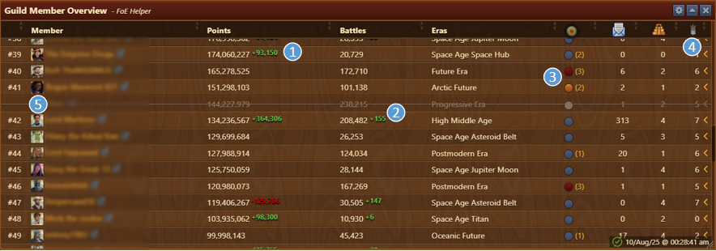
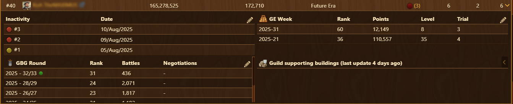

# Guild Member Overview

The Guild Member Overview module displays detailed information about your guildmates, including their Great Buildings, guild buildings, treasury resources, collection potential per day, and their current era.

## Menu Overview

The interface includes:

- **Title Bar** with [Configuration](#configuration) menu
- A **search bar** (can be toggled in [Configuration](#configuration))
- [**Tabs**](#tabs) for switching between views
- A **content area** displaying tab-specific data
- **Last updated timestamp** in bottom right corner

## Configuration

The configuration menu allows you to:

- **open overview after update**: if enabled, automatically open this window when you open **Your Guild** in the game menu ([keyboard shortcut](https://en.wiki.forgeofempires.com/index.php?title=Keyboard_shortcuts) ""G")
- **show searchbar**: toggles searhbar on tabs
- **show ex-members**: toggles searhbar on tabs
- **show 0-values (GE/GBG)**: highlight players with 0 values in both
- **GE/GBG date format**: choose display format for seasons
- **delete ex-member after**: define data retention for ex-members
- **reset message counter**: toggle to yes to reset message counter
- **export data**: exports data into file named by tab name (in English), date, and time of export.


The Export button (CSV or JSON) exports only the data shown in the currently active tab.


## Usage

- Sort any column by clicking on its header.
- Data is refreshed when:
  - You open in-game Guild Menu (shortcut "G"), tab Member Overview 
  - You open in-game Guild Menu (shortcut "G"), tab Guild Treasury
  - You visit a guildmate's city (eg. Great Buildings)
  - You enter the [Guild Expedition](../gex/README.md#recording-data) screen
  - You open [Guild Battlegrounds](../gbg-players/README.md#recording-data) screen
- Changes are based on your last local update on the same computer.

## Tabs

Available tabs:
- [Guild Members](#guild-members)
- [Eras](#eras)
- [Great Buildings](#great-buildings)
- [Guild Buildings](#guild-buildings)
- [Treasury Goods](#treasury-goods)

### Guild Members

Members Overview displays following:
- **Points**: Players points and change since the last update shown. (1)
  - Green: Increase in points
  - Red: Decrease in points
- **Battles**: Players number of battles and change since the last update. (2)
  - Green: Increased number of battles
- **Era**: Players era
- **Activity Status**: Players activity status. (3)
  - Yellow: Absent up to 3 days
  - Red: Absent over 3 days
  - Number in brackets: Number of days player was absent
- **GE/GBG** Participation
- **Chevron**: Clicking the **chevron** on a member’s row expands to [detailed overview](#members-detailed-view)
- **Strikethrough**: If enabled, Departed members will appear with strikethrough and without rank number. (5)

#### Members Detailed View

By clicking on the chevron at the right end of a member's row, you can expand to detailed overview of:
  - **Inactivity**: Displaying days when player was inactive (If applicable)
  - **GE**: Displaying GE performance per season for selected player
  - **GbG**: Displaying GBG performance per season for selected player
  - **Guild supporting Buildings**: Displays guild supporting productions
    - Clicking on the chevron, this table expands additionaly to display Guild Goods and Guild Power productions


Data covers all retained history on your PC.


The pencil in the upper right corner of tables allows you to open edit mode and to delete any week of results. A warning message will be displayed before granting you access to delete.

### Eras

Displays the number of members per era, total points, and treasury resources by era. 

Expanding to detailed overview displays which players are in specific era, and amount of each goods in treasury for that era. That can be achieved by:
1. Clicking the chevron for detailed view for specific era.
2. Clicking the chevron in header to expand to detailed view for all eras.

### Great Buildings

Displays the overview of Great Buildings available, players and levels range.

#### GB Summary Overview

Displays for each Great Building:

- **Great Building**: Name of Great Building
- **Available**: Number of Great Buildings available in Guild
- **Min Level**: Lowest level found
- **Max Level**: Highest level found

Use the chevron to expand to detail view for each GB displaying following data:

- **Player**: Names of players having GB
- **Level**: Current level of GB
- **Unlocked to**: Max level unlocked
- **FP Invested**: FP already invested
- **FP Needed**: Remaining FP to complete level  
- **Members without**: List of players which **don’t own** this GB.

#### GB Detailed View

By clicking on **Change view** button, detailed view is displayed. 

  

Lists every GB available in the guild with full details:

- Level
- Unlocked to
- FP Invested
- FP Needed


Clicking the **Change view** button returns to the previous GB view.


### Guild Buildings

Displays the overview of Guild Goods producing buildings available.

#### Guild Building Summary

  
Displays:

- Number of each guild goods producing building
- Resources produced (if motivated/collected by players)

#### Guild Building Detail

By clicking on **Change view** button, detailed view is displayed.

  
Displays for each building:

- Owner
- Era of member or building
- Collected amount of resources
- Guild power (if colected)


Clicking the **Change view** button returns to the previous GB view.


### Treasury Goods

Displays:

- Resources generated per day by all guild buildings
- Number of guild members in that era
- Total stock of guild treasury  


Daily production is a theoretical max and depends on members collection.
